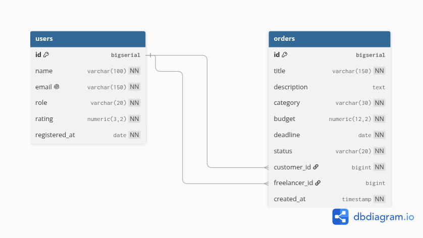

# youDO — биржа фриланса

Консольная информационная система «Биржа фриланса» для дисциплины «Программирование корпоративных систем» (КР 1).
Группа ЭФБО-17-24: Джумагулов Карим, Епифанов Денис, Гришутина Ангелина, Васин Сергей.

Заказчики публикуют заказы на фриланс-работу, фрилансеры их выполняют. Система ведёт пользователей и заказы, проверяет бизнес-правила, ищет, фильтрует, сортирует, считает статистику и экспортирует данные в Excel/CSV.

## Стек

- Java 17, Maven
- PostgreSQL 14+, JDBC (`PreparedStatement`, try-with-resources)
- Apache POI — экспорт `.xlsx`
- JUnit 5 — тесты бизнес-правил

## Архитектура

```
Console UI (ui/)  →  Service (service/)  →  Repository / JDBC (repository/)  →  PostgreSQL
```

## Предметная модель

- **User** — участник биржи: `id, name, email (unique), role (CUSTOMER | FREELANCER), rating, registeredAt`
- **Order** — заказ на фриланс-работу: `id, title, description, category, budget, deadline, status, customerId → users, freelancerId → users (nullable), createdAt`
- **OrderStatus**: `OPEN → IN_PROGRESS → ON_REVIEW → COMPLETED`, из `OPEN`/`IN_PROGRESS` возможен `CANCELLED`

### Бизнес-правила

1. Название заказа не может быть пустым.
2. Бюджет заказа больше нуля.
3. Дедлайн не может быть в прошлом.
4. Заказчик должен существовать и иметь роль `CUSTOMER`, исполнитель — роль `FREELANCER`.
5. Заказчик не может быть исполнителем своего заказа.
6. Разрешены только переходы статусов по схеме выше; в работу можно взять только заказ с назначенным исполнителем.
7. Нельзя удалить пользователя, у которого есть активные заказы.
8. Email пользователя уникален.

## Меню

```
============ БИРЖА ФРИЛАНСА youDO ============
1. Пользователи
2. Заказы
3. Поиск заказов
4. Фильтрация заказов
5. Сортировка заказов
6. Статистика
7. Экспорт данных
8. Вывести таблицы базы данных
0. Выход
```

## Запуск

Требования: Java 17, Maven, PostgreSQL 14 или новее. Все команды выполняются из корня репозитория.

**1. Пользователь и база** (один раз):

```
sudo -u postgres psql
```

На Windows вместо этого `psql -U postgres`, на macOS с Homebrew — `psql postgres`. Внутри psql:

```sql
CREATE USER youdo WITH PASSWORD 'youdo';
CREATE DATABASE youdo OWNER youdo;
\q
```

**2. Схема и тестовые данные** (пароль `youdo`). Оба скрипта можно запускать повторно, они сами очищают старые данные:

```
psql -h localhost -U youdo -d youdo -f sql/schema.sql
psql -h localhost -U youdo -d youdo -f sql/seed.sql
```

Проверка без приложения: `psql -h localhost -U youdo -d youdo -c "SELECT count(*) FROM orders"` должно вернуть 12.

**3. Настройки подключения:**

```
cp src/main/resources/db.properties.example src/main/resources/db.properties
```

Если логин, пароль или порт другие, поправьте их в `db.properties`. Файл в `.gitignore` и в репозиторий не попадает.

**4. Сборка и запуск:**

```
mvn package
java -jar target/youdo.jar
```

На Windows, чтобы кириллица в консоли не превращалась в кракозябры, перед запуском:

```
chcp 65001
java -Dfile.encoding=UTF-8 -jar target/youdo.jar
```

Если в системе только Java 11: `sudo apt install openjdk-17-jdk`.

## Тесты

```
mvn test
```

Тесты бизнес-правил (JUnit 5) работают с in-memory репозиториями, база для них не нужна.

## Экспорт

Пункт 7 меню сохраняет пользователей и заказы в папку `export/` (создаётся сама, если её нет):

- `youdo_export_<дата>.xlsx` — Excel, листы «Пользователи» и «Заказы»; даты и суммы записаны как даты и числа;
- `users.csv` и `orders.csv` — CSV для русского Excel: разделитель `;`, кодировка UTF-8 с BOM, дробные числа через запятую.

## Структура проекта

```
src/main/java/ru/mirea/freelance/
├── model/        User, Order, UserRole, OrderCategory, OrderStatus
├── repository/   Repository, UserRepository, OrderRepository и их JDBC-реализации
├── service/      бизнес-правила, поиск, фильтрация, сортировка; StatisticsService
├── ui/           консольное меню
├── util/         DatabaseManager, экспорт (Exporter, ExcelExporter, CsvExporter), DbInspector
└── exception/    DatabaseException, BusinessException
sql/              schema.sql — таблицы, seed.sql — тестовые данные
docs/             ER-диаграмма
export/           файлы экспорта
```

| Кто | За что отвечает |
|---|---|
| Епифанов Денис | каркас и сборка, SQL-схема и тестовые данные, подключение к БД, репозитории на JDBC, ER-диаграмма |
| Джумагулов Карим | модель, сервисы и бизнес-правила, поиск/фильтрация/сортировка, тесты |
| Гришутина Ангелина | консольное меню |
| Васин Сергей | статистика, экспорт в Excel и CSV, вывод таблиц БД, README |

## ER-диаграмма


